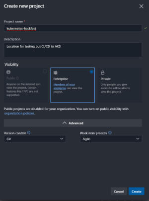
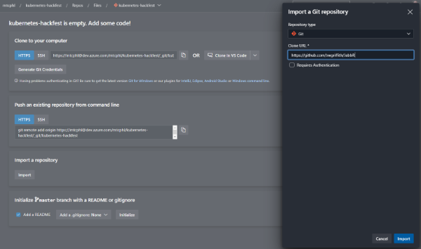
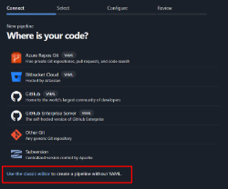
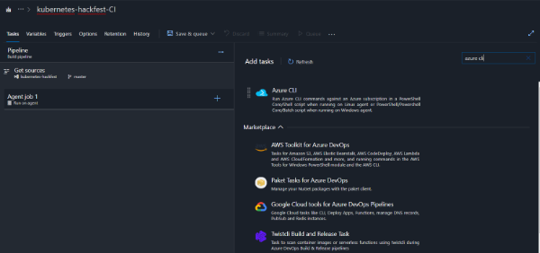
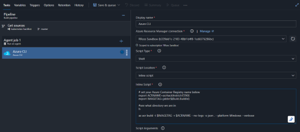
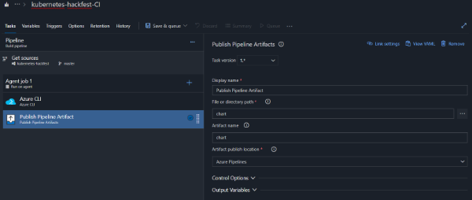
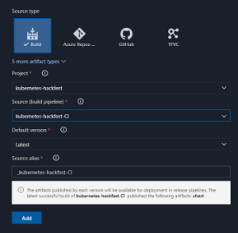
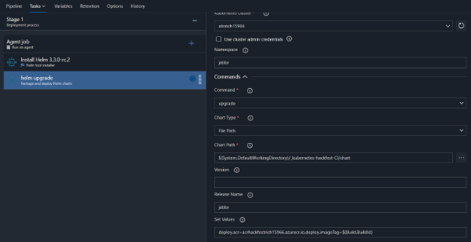
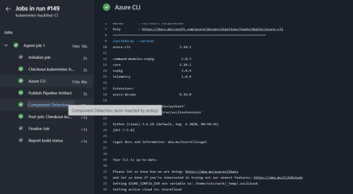
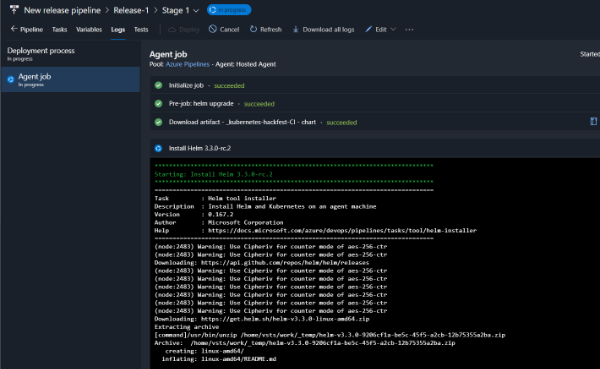

# Azure DevOps Lab

## Overview

This workshop will guide you through building Continuous Integration (CI) and Continuous Deployment (CD) pipelines with Azure DevOps for use with Azure Kubernetes Service. The pipeline will utilize Azure Container Registry to build the images and Helm for application updating. 

## Prerequisites 

* Complete previous labs:
    * [Azure Kubernetes Service](../../create-aks-cluster/README.md)
    * [Build Application Components in Azure Container Registry](../../build-application/README.md)
    * [Helm Setup and Deploy Application](../../helm-setup-deploy/README.md)

## Instructions

The general workflow/result will be as follows:

* Push code to source control
* Trigger a continuous integration (CI) build pipeline when project code is updated via Git
* Package app code into a container image (Docker Image) created and stored with Azure Container Registry
* Trigger a continuous deployment (CD) release pipeline upon a successful build
* Deploy container image to AKS upon successful a release (via Helm chart)
* Rinse and repeat upon each code update via Git
* Profit


#### Setup Azure DevOps Project

1. Navigate to your Azure DevOps Organization. [Azure DevOps](https://dev.azure.com/)
1. Create New Project in Azure DevOps

    * Name your project "kubernetes-hackfest" and give it a description.
    * Leave the Version control as Git

    

1. On the next screen, click "Repos" and then "Import a repository"

    Enter `https://github.com/richross/JabbR` for the Clone URL and click "Import"
    



#### Create Build Pipeline


1. In Azure DevOps, click on "Pipelines" on the left menu and then click "Builds"

1. Click the "New pipeline" button

1. Azure DevOps pipelines now defaults to the yaml based editing experience. The following steps assume classic mode, so you should select 'Use the classic editor' as shown below.

    

1. In "Select a source," use `Azure Repos Git` and ensure it is pointing to your newly built repo (this is the default).  Click Continue.
    > Note that we are using the master branch here. Normally we would use other branches and PR's. For simplicity, we are using master just for this lab.

1. Select to "start with an Empty job" at the top of the property window.

1. Leave the name as "kubernetes-hackfest-CI"

1. Make sure the Agent pool is set to 'Azure Pipelines' and the Agent Specification is set to use the 'ubuntu-1804'

1. Click the plus sign by "Agent job 1" to add a task

1. Search tasks for "Azure" and add the Azure CLI task

    

1. Click on the Azure CLI task in the drop down for Azure Resource Manager, select the Azure Service Connection created from the Service Provider.  

> [!IMPORTANT]
> We will create this in the lab once and it will be available to all participants.

1. For "Script Type" select "Shell".

1. For "Script Location" choose "Inline script" and enter the following (be sure to replace the ACR name with yours). 

    > Note: We are creating a dynamic image tag using our build ID from Azure DevOps.

    ```bash
    # set your Azure Container Registry name below
    export ACRNAME=<your acr name>
    export IMAGETAG=jabbr:$(Build.BuildId)

    az acr build -t $IMAGETAG -r $ACRNAME --no-logs -o json . --platform Windows --verbose
    ```

    

1. Add a final task to "Agent job 1" and search for "Publish Pipeline Artifact". Select it and click Add to bring it into the build.

1. Use "chart" for the "Artifact name" and browse to the charts folder for the "File or directory path".

    

1. Test this by clicking "Save & queue".  Provide a comment.  Click Save and Run button at the bottom of the property window.

1. Click on "Builds" to check result. It can take a bit of time for all of the steps to complete. 

1. Enable Continuous integration for the build definition. Edit the build definition and you will find this setting under "Triggers"


#### Create Deployment Pipeline

In the deployment pipeline, we will create a Helm task to update our application. 

1. In Azure DevOps, click on "Pipelines" on the left menu and then click "Releases"

1. Click the "New pipeline" button

1. Select to "start with an Empty job"

1. Name the pipeline "AKS Helm Deploy" (it will default to "New release pipeline")

> [!NOTE]
> You may run into an issue trying to change the name of the pipeline.  If that happens, keep the existing name.

1. Click on "+ Add" next to Artifacts

1. In "Source (build pipeline)", select the build we created earlier (should be named "kubernetes-hackfest-CI")

    

1. Click on the lightning bolt next to the Artifact we just created and enable "Continuous deployment trigger"

1. Click on "Stage 1" in the Stages box.

1. Name the stage "dev"

1. Click on "1 job, 0 task" to view stage tasks

1. Click on "Agent job" and change the Agent pool to "Azure Pipelines" and the Agent Specification to "ubuntu-1804" in the drop down

1. On the Agent job, click the "+" to add a Task

1. Search for "helm" and add the task called "Helm Tool Installer" as first task. Click Add

    > Change the version for the helm install to `3.3.0-rc.2`

1. Next, Search for "helm" and add the task called "Package and deploy Helm charts". Click Add

1. Click on the task (named "helm ls") to configure all of the settings for the release
    
    * Select your Azure subscription in the dropdown and click "Authorize"
    * Select the Resource Group and AKS Cluster
    * For Namespace, enter "jabbr"
    * For the Command select "upgrade"
    * For Chart type select "File Path"
    * For Chart path, click the "..." button and browse to the "chart" folder in the charts directory
    * For the Release Name, enter `jabbr`
    * For Set Values you will need to fix the ACR server to match your ACR server name and the imageTag needs to be set.
        Eg - `deploy.acr=acrhackfestrich15966.azurecr.io,deploy.imageTag=$(Build.BuildId)`

    

    * Click "Save".
    * Enter a comment and click Ok on the popup.

#### Run a test build

1. In Azure DevOps, click on Pipelines, and select "Run Pipeline" from the menu of the kubernetes-hackfest-CI build pipeline

1. Monitor the builds and wait for the build to complete

    

1. The release will automatically start when the build is complete (be patient, this can take some time). Review the results as it is complete. 

    

1. Validate that your newly built image was deployed in your AKS cluster. Eg - `kubectl describe pod service-tracker-ui-<pod id> -n hackfest`

1. Now kick-off the full CI/CD pipeline by making an edit to the service-tracker-ui frontend code in the Azure DevOps code repo.

## Troubleshooting / Debugging

* We've seen issues where people forgot to use the hackfest namespace in Kubernetes. 
* Ensure that are using the "ubuntu-18.04" image in Azure DevOps. 

## Docs / References

* Blog post by Jessica Dean. https://jessicadeen.com/how-to-deploy-to-kubernetes-using-helm-and-vsts 
* Focus .NET Conf on Microservices -> https://www.youtube.com/watch?v=ZEvoxXnsbbU&list=PLdo4fOcmZ0oUc2ShrReCS7KoBbPEONE0p